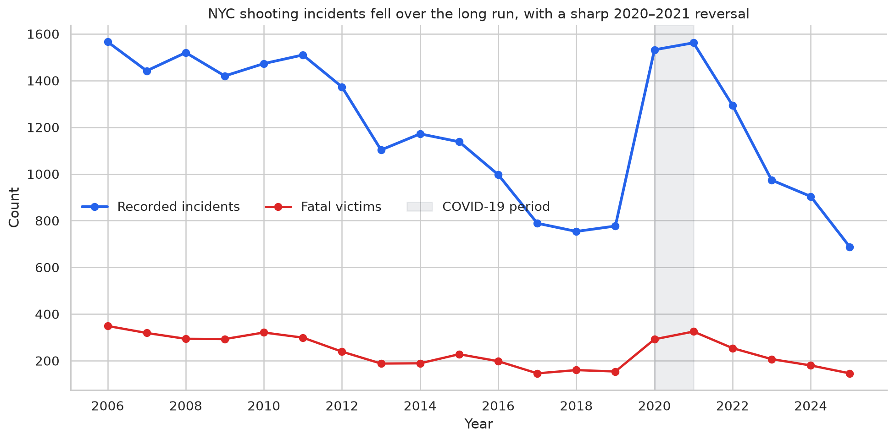
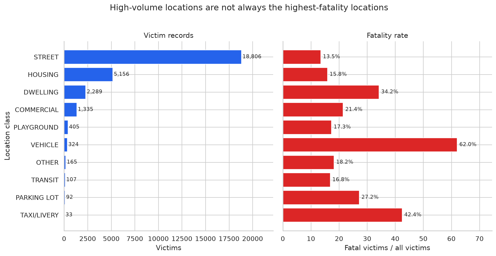

# NYC Shooting Trends & Fatality Classification

An end-to-end analysis of 23,988 recorded New York City shooting incidents and 28,748 victim records from 2006–2025. The project combines data-quality auditing, reproducible preprocessing, exploratory analysis, and an honest machine-learning benchmark for fatal victim outcomes.



## Key findings

- Recorded incidents declined from 1,566 in 2006 to 777 in 2019, then rose sharply during 2020–2021 before falling to 688 in 2025—the lowest full-year count in this snapshot.
- July averaged 138.9 incidents per year, compared with 60.6 in February, showing a consistent warm-season concentration.
- Streets accounted for 18,806 victim records and had a 13.5% observed fatality rate. Vehicles had a 62.0% rate, but only 324 victim records, so the estimate is much less stable.
- On a 2022–2025 temporal holdout, the random-forest benchmark reached 0.244 average precision versus a 0.168 no-skill baseline. Balanced accuracy was 0.544 and fatal-case recall was 0.342: useful evidence of limited signal, not deployment-ready performance.



## Why this project is technically interesting

The raw data has three different row grains: one row per incident, one row per victim, and one row per recorded offender. A direct three-table join creates 5,400 extra rows because incidents can have multiple victims and offenders. The pipeline avoids that many-to-many inflation by:

1. using the incident table for trend and seasonality counts;
2. joining victims to incidents with a validated `many_to_one` relationship;
3. keeping offender records separate unless an analysis explicitly needs them.

The modelling workflow also uses a future-period holdout rather than a random split, handles unseen categories with a preprocessing pipeline, compares against a majority-class baseline, and excludes victim demographic attributes from the feature set.

## Project structure

```text
├── data/
│   ├── raw/          # Original incident, victim, and offender extracts
│   ├── processed/    # Reproducible, analysis-ready tables
│   └── reference/    # Law and violence-prevention context tables
├── notebooks/
│   ├── 01_data_audit.ipynb
│   ├── 02_data_preparation.ipynb
│   └── 03_analysis_and_modeling.ipynb
├── reports/figures/  # Portfolio-ready chart exports
├── src/
│   ├── data_pipeline.py
│   └── helpers.py
├── tests/            # Unit tests for cleaning and validation logic
└── requirements.txt
```

Start with [`03_analysis_and_modeling.ipynb`](notebooks/03_analysis_and_modeling.ipynb) for the main narrative. The first two notebooks document data quality and preparation decisions.

## Reproduce the analysis

Python 3.10 or newer is recommended.

```bash
python -m venv .venv
source .venv/bin/activate
python -m pip install -r requirements.txt
python -m src.data_pipeline
pytest -q
jupyter lab
```

Run the notebooks in numeric order. The pipeline writes four processed CSV files, and the analysis notebook refreshes all figures in `reports/figures/`.

## Data and methodology notes

The repository contains a snapshot of NYPD shooting records covering January 1, 2006 through December 31, 2025. The related public dataset is available through [NYC Open Data](https://data.cityofnewyork.us/Public-Safety/NYPD-Shooting-Incident-Data-Historic-/833y-fsy8/about_data). Law and program dates in `data/reference/` are included only as descriptive context and are not model inputs.

This is an observational portfolio project. It does not estimate whether a law or program caused a change in shootings. The records are administrative data, counts are not population-adjusted, missing offender details are not evidence that no offender existed, and demographic distributions should not be interpreted as population risk. The classifier is an educational benchmark and is not suitable for operational or high-stakes use.

## Tools demonstrated

Python, pandas, seaborn, Matplotlib, scikit-learn, data validation, feature preprocessing, imbalanced-class evaluation, temporal holdout design, and responsible interpretation.
